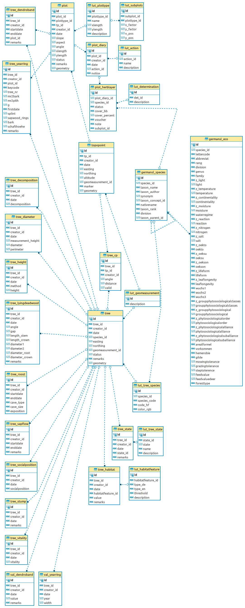

# General Setting
The MOFgeoDB is a [SQlite](https://www.sqlite.org/) database using the spatial extension [spatialite](https://www.gaia-gis.it/fossil/libspatialite) and serves our data of vegetation (mainly trees) and study plots for ecosystem research (forest structure, experiments) over time. Additional there are some auxiliary datasets (geopackage) of infrastructure for visual reasons. [QGIS](https://qgis.org/) is used as back-end for analysis and visualization.

# Relational Structure
First overview of the relational structure gives figure \@ref(fig:erd-complete-fig)

```{r erd-complete-fig, echo=FALSE, fig.align='center', out.width='500px', fig.cap='Complete ER diagram of MOFgeoDB without creator table', fig.alt='ER diagram MOFgeoDB complete'}

```

The database can be divided into following sections

* Trees
* Plots
* Lookup tables

When necessary the creator (referenced via `creator_id`) and the date (day) of each single measurement is noted. Creator are stored in the look-up table `lut_creator` which can be a single person or (study) group and is designed rather simple.

### Trees
Trees are measured as single individiums from a diameter of 7 cm. All trees have a unique identifier (`tree_id`) which is a combination of a lowercase letter (r=red, b=blue) and a five digit number. These identifiers are nailed to the real trees as in figure XX shown to identify them in the field.  Beside the geolocation of the center point at surface (`easting`,`northing`) and the method of this measurement (`geomeasurement_id`, see chapter geomeasurements), the species is mandatory via the species list (`species_id` from `german_sl`, [GermanSL](https://germansl.infinitenature.org/)).

Following items can be additionally stored via the corresponding tables using the referencing `tree_id` and are dependent on time:

* general parameters
  * diameter: default breast height 1.3 m, triggers calculation of perimeter or diameter on circle
  * height: method is free text
  * state: looking up state via `state_id` as shown in table below.
  * social position: after cite 
  * vitality: after cite
  * habitat: multiple micro-habitats per tree after cite
* special investigations
  * sapflow: some trees installed with sapflow measurement
  * dendroband: manual dendrometer, see figure foto
  * yearring: investigation of yearrings using cores
  * roost: determined roosts for bats
* dead wood
  * lying deadwood: size and position of lying deadwood >20 cm diameter
  * decomposition: decomposition rate for deadwood after cite

### Plots
There are different type of survey plots (see `lut_plottype`):

<!-- und auch hier besser tabelle aus db direkt auslesen mit anzahl o.ä.-->
plottype_id | name | xLength | yLength | description
------------|------|---------|---------|-------------
fs | forest structure | 20.0 | NULL | Waldstrukturplots nach Jürgen in den Masterkursen
de | dendro ecology | 80.0 | NULL | Jahrringbaumfelder zur Aggregierung der Daten, eher virtuell
exc | exclosure plot | 16.0 | 8.0 | Auschlussplots aus Gattern und Vergleichsplots
ps | pasture structure | 2.0 | 2.0 | Vegetationsaufnahmen im Freiland oder Wiese 2m*2m
dm | dendrometer band field | 50.0 | NULL | Dendrometerbandfelder zur Aggregierung der Einzelbäume, eher virtuell
pg | polygon | NULL | NULL | unregelmäßiger Plot als Polygon
sub | subplot | NULL | NULL | Subplot als regelmäßige Unterteilung eines größeren Plots 

Most common is the fs-plot for forest structure survey. Most of the plots get there geolocation from a fixed benchmark in the field (see figure X) documented in `topopoint`.

The `plot_diary`can be used to document surveys on a plot linking specific actions (`lut_action`)


### Lookup Tables

#### lut_tree_state
<!-- eigentlich besser direkt aus der db lesen und die Tabelle anzeigen lassen -->
state_id | state | name | description
---------|-------|------|----------------
1.1 | 1 |	alive |	first survey living tree
1.2 |	1 |	alive |	living tree from young growth
2.4 |	0 |	dead |	died unspecified
2.1 |	0 |	dead |	first survey dead tree
2.2 |	0 |	dead |	trunk fracture
2.3 |	0 |	dead |	windthrow with uprooted tree
3.1 |	0 |	felling |	felling only
3.2 |	0 |	timber extraction |	felling and timber extraction
3.3 |	1 |	limbing |	limbing
3.4 |	1 |	bark ringing |	bark ringing
2.5 |	0 |	dead |	first survey stump only
0 |	1 |	db | first db entry

# Auxiliary Data

Other geographic datasets are stored as geopackage. In the `supplementary` package following layers are available:

* streets: including footpaths, etc. based on OSM, arial images and  Lidar
* water: 
* forest divisions: as used by HessenForst
* infrastructure: point data on scietifc instruments and other POIs
* area plots: non scientific plots or fences

The `elevation_simple` package shows simplified contours derived from the DEM.

# Raster Data

### UAV
Orthofotos and pointclouds are generated on behalf of  [NATUR4.0](https://github.com/Nature40) from UAV raw data. More derivates are calculateted like tree segmentation, canopy heights, etc. (see somewhere? cite?) 

### LIDAR

### Arial / Satellite Imagery

# Sources