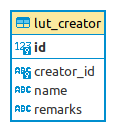
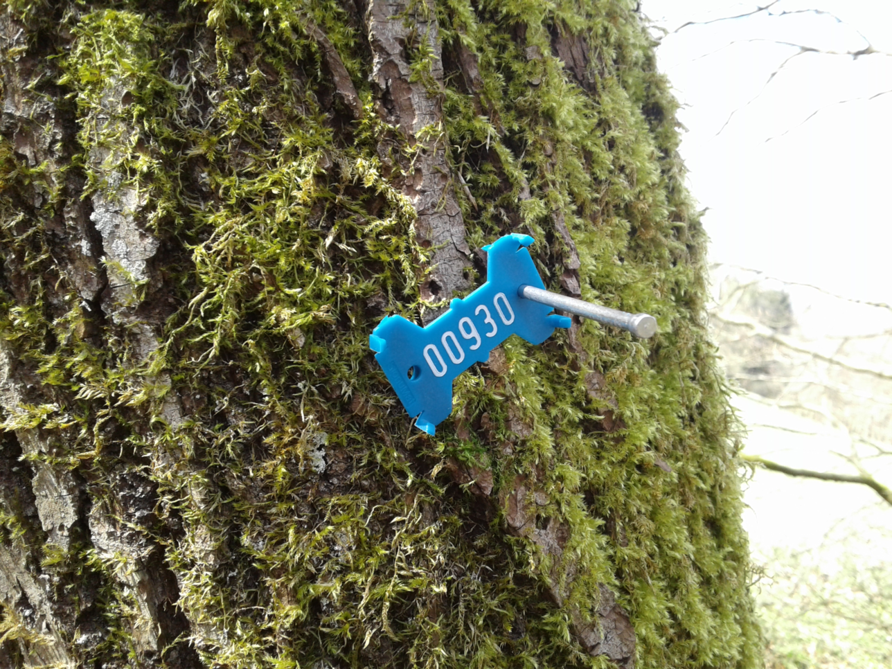
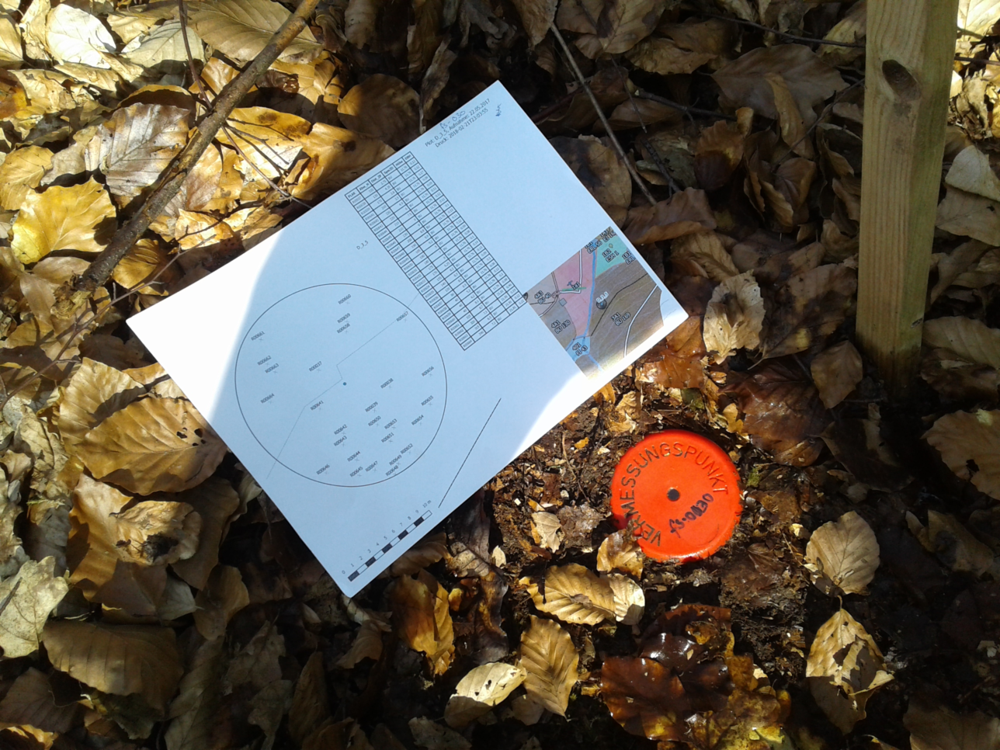

# General Setting
The MOFgeoDB is a [SQlite](https://www.sqlite.org/) database using the spatial extension [spatialite](https://www.gaia-gis.it/fossil/libspatialite) and serves our data of vegetation (mainly trees) and study plots for ecosystem research (forest structure, experiments) over time. Additional there are some auxiliary datasets (geopackage) of infrastructure for visual reasons. [QGIS](https://qgis.org/) is used as back-end for analysis and visualization.

# Relational Structure
First overview of the relational structure gives figure \@ref(fig:erd-complete-fig).

```{r erd-complete-fig, echo=FALSE, fig.align='center', out.width='800px', fig.cap='Complete ER diagram of MOFgeoDB without `lut_creator` table', fig.alt='ER diagram MOFgeoDB complete'}
knitr::include_graphics("images/erd_complete.png")
```

The database can be divided into following sections:

* Trees,
* Plots,
* Lookup tables.

When necessary the creator (referenced via `creator_id`, see fig. \@ref(fig:erd-lut-creator-fig)) and the date (day) of each single measurement is noted. Creator are stored in the look-up table `lut_creator` which can be a single person or (study) group and is designed rather simple.

```{r erd-lut-creator-fig, echo=FALSE, fig.align='center', fig.cap='Table lut_creator', fig.alt='Table structure lut_creator'}

```

### Trees
Trees are measured as single individiums from a diameter of 7 cm. All trees have a unique identifier (`tree_id`) which is a combination of a lowercase letter (r=red, b=blue) and a five digit number. These identifiers are nailed to the real trees as in figure \@ref(fig:tree-marker) shown to identify them in the field.  Beside the geolocation of the center point at surface (`easting`,`northing`) and the method of this measurement (`geomeasurement_id`, see chapter geomeasurements), the species is mandatory via the species list (`species_id` from `german_sl`, [GermanSL](https://germansl.infinitenature.org/)).

```{r tree-marker, echo=FALSE, fig.align='center', fig.cap='Marker on tree as `tree_id`, here b00930', fig.alt='Marker on tree'}

```

Geolocation is possible via a direct measurement of coordinates (usually using some sort of GNSS or terrestrial survey) or the determination via a topopoint using angle and distance as polar coordinates. [Triggers](../2021-12-09-triggers/) calculate the coordinates on insert and update of relevant items.

Following items can be additionally stored via the corresponding tables using the referencing `tree_id` and are dependent on time:

* general parameters
  * diameter: default breast height 1.3 m, [triggers](../2021-12-09-triggers/) calculation of perimeter or diameter on circle
  * height: method is free text
  * state: looking up state via `state_id` as shown in table below.
  * social position: after @eichhorn_part_2020 p.11
  * vitality: after @roloff_baumkronen_2001
  * habitat: multiple micro-habitats per tree after @larrieu_tree_2018-1
* special investigations
  * sapflow: some trees installed with sapflow measurement (no values available by now)
  * dendroband: manual dendrometer, see figure foto
  * yearring: investigation of yearrings using cores (conducted by Burkhard Neuwirth, [DELAWI](http://www.delawi.de/))
  * roost: determined roosts for bats
* dead wood
  * lying deadwood: size and position of lying deadwood >20 cm diameter
  * decomposition: decomposition rate for deadwood after @schwill_handbuch_2016 p.10
  
### Plots
There are different type of survey plots (see also [`lut_plottype`](../2021-12-10-lookup-tables/)):

* forest structure **fs**
* exclosure plot **exc**
* dendro ecology **de**
* dendrometer band field **dm**
* pasture structure **ps**
* polygon unspecified **pg**
* subplot **sub**

Most common is the fs-plot for forest structure survey. Most of the plots get their geolocation from a fixed benchmark in the field (see figure \@ref(fig:benchmark-fig)) documented in `topopoint`.

```{r benchmark-fig, echo=FALSE, fig.align='center', fig.cap='Benchmark', fig.alt='Benchmark'}

```

The `plot_diary`can be used to document surveys on a plot linking specific actions (`lut_action`) to the desired plot and time. Automatic generation of subplots are possible and is implemented using triggers for the exclosure plot design. Triggers also manage the insertion, update and deletion of topopoints and plots.

All plottypes are documented in the post [Plots](../2021-12-10-plots/).

### Views
Views are created in the database to collect data from different tables for various reasons. It is a very convenient way to work with just one table for further analysis or visualizations. It insures the use of the desired data and has the capability to generate new fields like statistical parameters. All generated views are discussed in an special [post](../2021-12-10-views/).

### Lookup Tables
Lookup tables just serve the idea to connect recurring items using a primary key. All lookup tables are documented in a separate [post](../2021-12-10-lookup-tables/).

# Auxiliary Data

### Vector data

Other geographic datasets are stored as geopackage. In the `supplementary` geopackage following layers are available:

* streets: including footpaths, etc. based on OSM, arial images and  Lidar
* water: 
* forest divisions: as used by HessenForst
* infrastructure: point data on scietifc instruments and other POIs
* area plots: non scientific plots or fences

The `elevation_simple` geopackage shows simplified contours derived from the DEM.

### QGIS
A QGIS projectfile is offered for a sophisticated cartographic representation of the data.

# Raster Data
All raster data is stored in seperated files as geoTiff.

### UAV
Orthofotos and pointclouds are generated on behalf of  [NATUR4.0](https://github.com/Nature40) from UAV raw data. More derivates are calculateted like tree segmentation, canopy heights, etc. (see somewhere? cite?) 

### LIDAR
Lidar Data from the state authorities are used to calculate DEM, DGM and canopy height.

### Arial / Satellite Imagery
Arial RGB orthofotos from the state authoroties and several satellite imagery (Sentinel, planetscope) are available.

# Resources